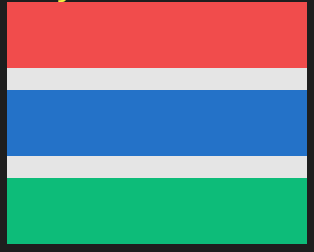
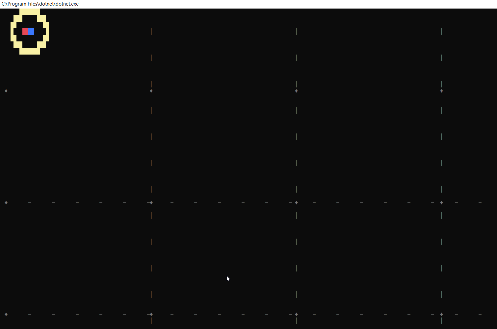

# Flag lesson (C# fundamentals) with extended Console testing

> The project with the drawing of flags is an exercise in the C# fundamentals course in my education. The Console GUI is a part of starting project doing visual 2d graphics in the Console. I keep building on this during this first semester and on forward until the StarWars API project [SpaceParkV1](https://github.com/PGBSNH20/spacepark-spacex) and [SpaceParkV2.](https://github.com/PGBSNH20/spaceparkv2-buddygroup6-renegades)

